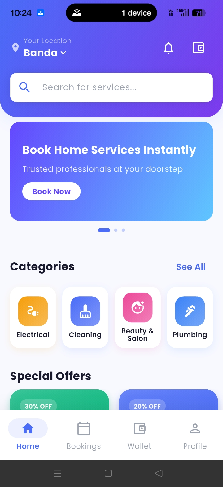
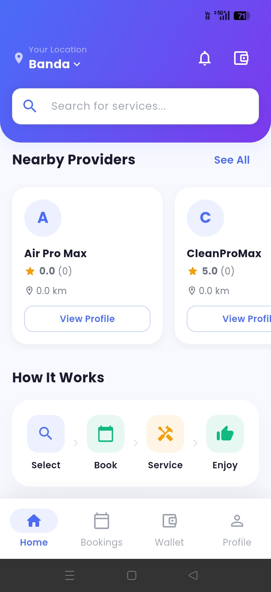
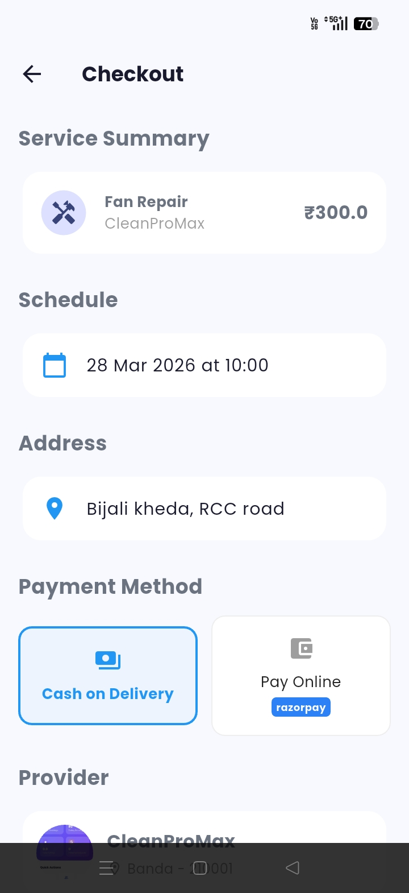
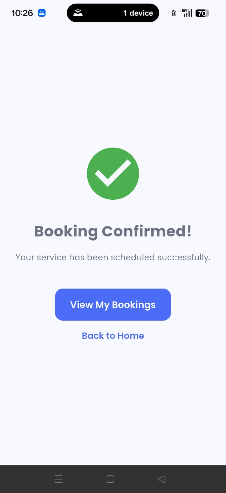
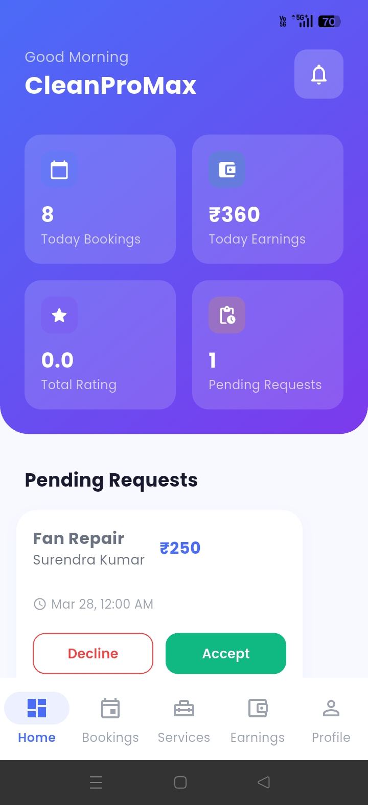
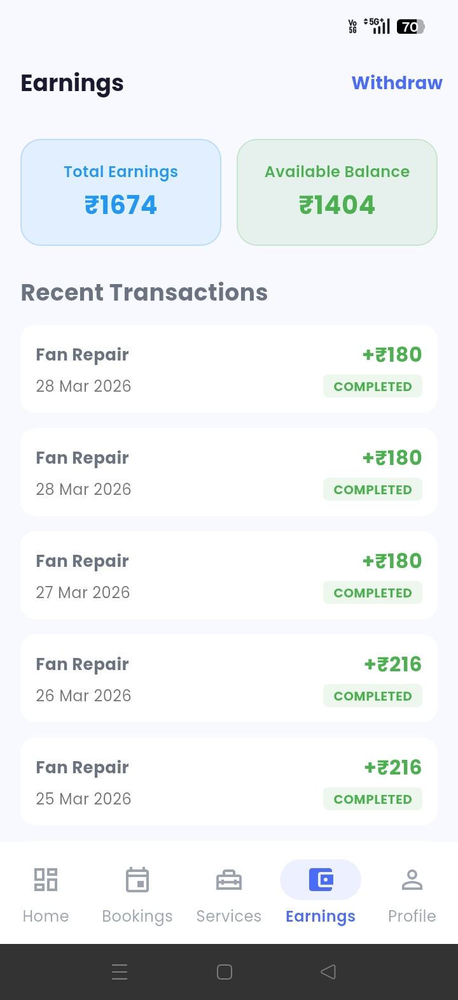
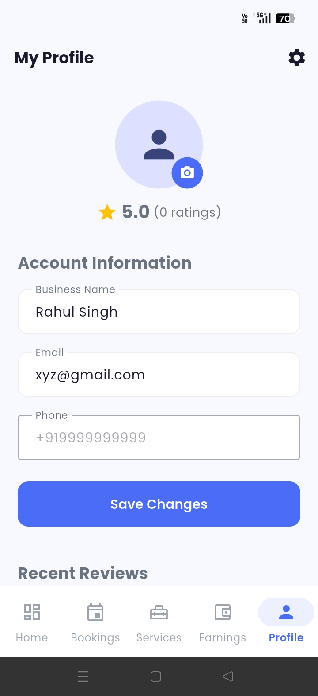
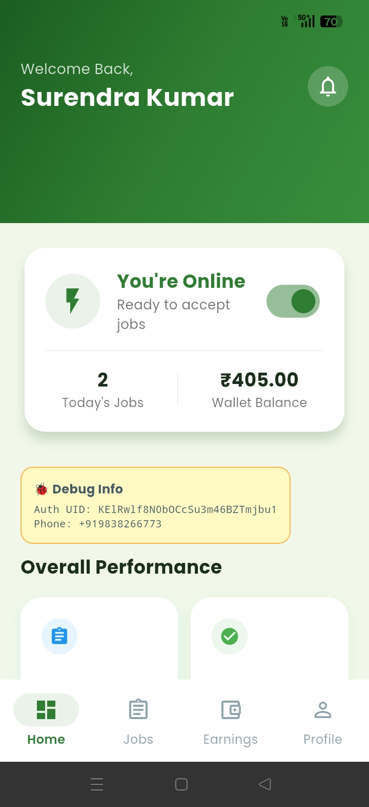
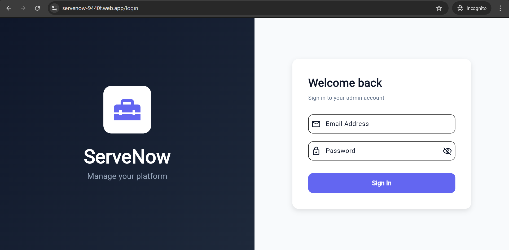
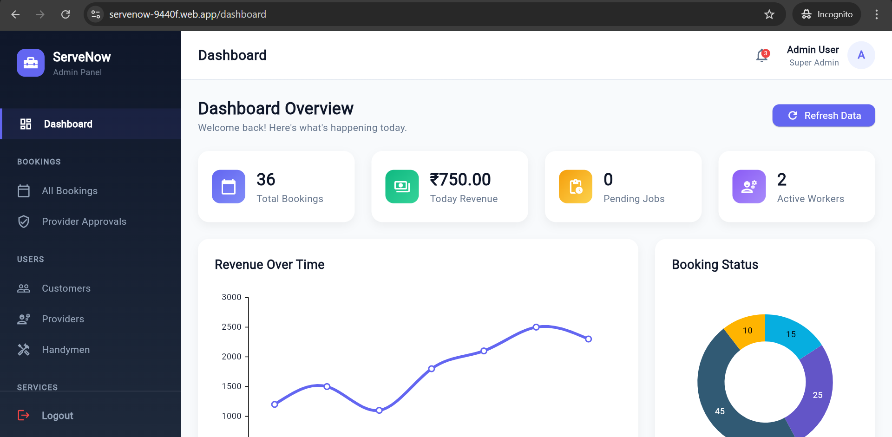

# ServeNow — Complete Home Services Platform

Flutter + Firebase home services marketplace with 4 apps:
**Customer App** · **Provider App** · **Handyman App** · **Flutter Web Admin Panel**

ServeNow is a comprehensive, production-ready home services marketplace solution. It enables customers to book professionals for various services like AC repair, plumbing, cleaning, and more, while allowing providers and handymen to manage their business and jobs efficiently.

## 📸 Screenshots

### Customer App
| Home | Services | Booking | Tracking |
|---|---|---|---|
|  |  |  |  |

### Provider App
| Dashboard | Bookings | Earnings |
|---|---|---|
|  |  |  |

### Handyman App & Admin Panel
| Handyman Jobs | Admin Dashboard | Admin Bookings |
|---|---|---|
|  |  |  |

## 🔴 Live Demo

| | Link |
|---|---|
| 🌐 Admin Panel | [https://servenow-9440f.web.app](https://servenow-9440f.web.app) |
| 📱 Customer App | [Download APK](https://drive.google.com/file/d/1dI-sxmjLVT4pvX5rvUFWvQto7Mgjfyqe/view?usp=drive_link) |
| 🔧 Provider App | [Download APK](https://drive.google.com/file/d/1skGxaYjxedf1SoMrPvORTU0FAFWwJqFU/view?usp=drive_link) |
| 👷 Handyman App | [Download APK](https://drive.google.com/file/d/1pBEeRGvVXXXBzi3uPHjTyBAlGOLVcmyQ/view?usp=drive_link) |

**Admin Panel Demo Login:**
- Email: `Admin@servenow.com`
- Password: `Admin@123`

> Note: Demo account has read-only access to protect live data.
## 💰 Get the Source Code

> **$69** — Includes 3 custom modifications + free future updates

## Core Features
- 📱 **3 Mobile Apps**: Dedicated apps for Customers, Service Providers, and Handymen.
- 💻 **Admin Panel**: Powerful Flutter Web dashboard for managing users, categories, bookings, and payouts.
- 💳 **Payments**: Integrated with Razorpay for secure online transactions and Cash on Delivery support.
- 🗺️ **Live Tracking**: Real-time tracking of handymen using Google Maps.
- 💬 **Real-time Chat**: In-app messaging between customers and providers.
- 🔔 **Smart Notifications**: Push notifications for booking updates, new jobs, and messages.
- 💰 **Wallet & Earnings**: Transparent earnings management for providers and handymen.

## Quick Start
1. **Firebase Project**: Create a new project at [console.firebase.google.com](https://console.firebase.google.com).
2. **Setup Firebase**: Enable Authentication (Phone, Google), Firestore, Storage, and Functions.
3. **Database Seed**: Run `scripts/seed_all.js` to populate your Firestore with demo categories and services.
4. **Configuration**: Add your `google-services.json` and `GoogleService-Info.plist` to each mobile app.
5. **API Keys**: Configure Google Maps and Razorpay keys in `lib/core/constants/keys.dart`.
6. **Deploy Functions**: Deploy the included Cloud Functions using Firebase CLI.

## Tech Stack
- **Frontend**: Flutter 3.x (Clean Architecture, Riverpod, GetX)
- **Backend**: Firebase (Auth, Firestore, Storage, Messaging, Cloud Functions)
- **Payments**: Razorpay
- **Maps**: Google Maps API

## Documentation
For a complete step-by-step setup guide, please refer to **ServeNow_Documentation.pdf** included in the root directory.

## License
This project is licensed under the terms provided in the package.
